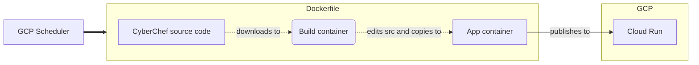

# dark-cyberchef
This is a Dockerfile to create a lightweight [CyberChef](https://github.com/gchq/CyberChef/) container with a default solarized dark theme :)

This is regularly built and deployed on Google Cloud here: https://dark-cyberchef-lxapdonpma-nw.a.run.app

The build runs once a month, in addition to whenever there are any commits to this repo.

## Using on your own system
1. Build the container: `docker build https://github.com/n-bs-p/dark-cyberchef.git#main -t dark-cyberchef`
2. Run the container: `docker run --rm -d -p 8080:8080 dark-cyberchef`
3. Navigate to http://localhost:8080

Whenever you want to get an updated version of CyberChef, just rebuild it from step 1.
