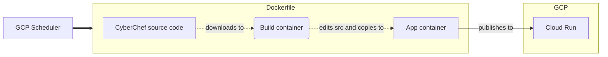

# dark-cyberchef
This is a Dockerfile to create a lightweight cyberchef container with a default solarized dark theme :)

This is regularly built and deployed on Google Cloud here: https://dark-cyberchef-lxapdonpma-nw.a.run.app
The build runs once a month, in addition to whenever there are any commits to this repo.

